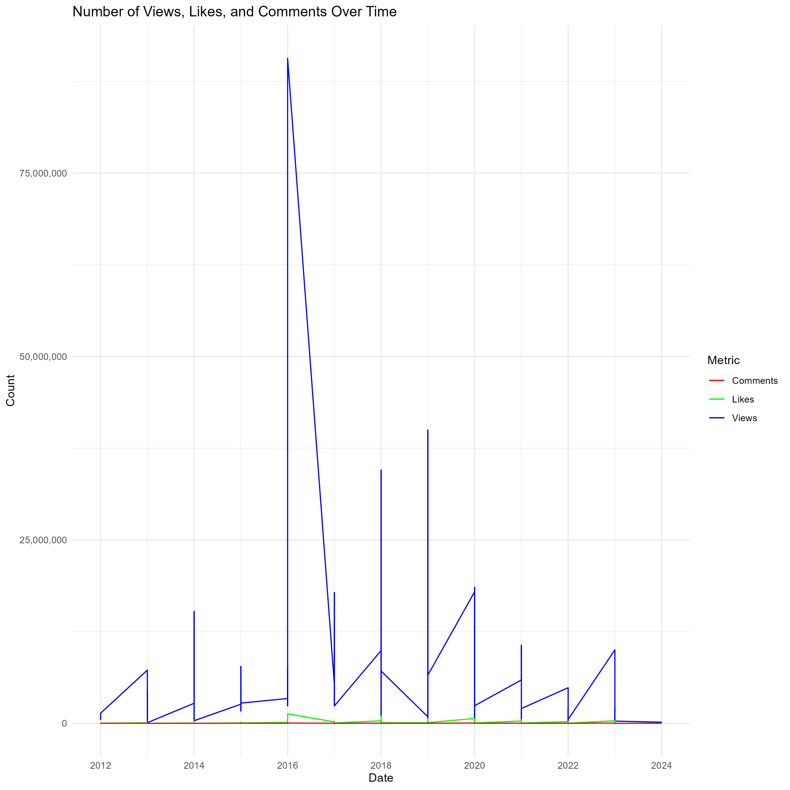

```{r setup, include=FALSE}
knitr::opts_chunk$set(echo=TRUE, message=FALSE, warning=FALSE, error=FALSE)
```

```{css echo=FALSE}
body { background-color: #FAD5A5; font-size: 15px; }

h2 { color: green; font-weight:700; font-size: 30px; font-family: "Lucida Console", "Courier New", monospace; border: 2px solid powderblue; }

h3 { color: maroon; font-family: Avirial, Helvetica, sans-serif; }
```

## Introduction

[Website](https://philiplim1509.github.io/stats220/)

[CSV](https://docs.google.com/spreadsheets/d/e/2PACX-1vRAk1VTiPEDf6H_bk442dTuh3CTLgjyd7HDgh-QhlkyWs-onXy8_ZnOp2i_BxgM0hIYx_gTB-rfw4fT/pub?output=csv)

My two youtube channel I selected are @LEMMiNO and @Rousseau

[Lemmino Link](https://www.youtube.com/@LEMMiNO)

[Rousseau Link](https://www.youtube.com/@Rousseau)

I Choose this Rousseau mainly because its a youtube channel about piano music (it covers from classical, pop, to almost every genre) and I listen to his piano cover a lot when studying because its soothing and helps me focus. 
For Lemmino, I followed his channel back it was from 2012 and it has significantly improve in terms of quality (content and production). Essentialy this channel is about informative content across various topics. I highly recommend visit his channel and watch some of his video if you have not.

Two ideas before accessed the data:

1. Subscriber Count between both channel across the year
2. Plot a time series graph showing the number of views, likes, and comments over time for each channel.
Use line graphs with different colors representing each metric for each channel.

# Summarisation of data process:

I decided to use features such as comments, views, and likes counts from the dataset, as they are crucial for evaluating the performance of a YouTube channel. I chose to employ line charts for comparing numerical variables over time, such as views vs years, as they effectively illustrate trends and patterns in continuous data. On the other hand, for comparisons involving numerical and categorical variables, such as categorizing videos into popular and non-popular, I utilised bar charts. Bar charts provide a clear visual representation of comparisons between different categories, making them suitable for conveying differences or relationships between numerical and categorical data.


However, one of the charts I attempted, illustrating the channel metrics over time, did not yield desired results. For reference, here is the chart: 



The plot displayed a significant disparity between views count and the rest of the metrics (likes and comments), resulting in an offset beyond millions, rendering it ineffective for analysis.

## Dynamic data story


## Creativity

For creativity i include more than 3 plots to my data story. This increase the overall complexity and add mores story to it. We can simplify the complexity of the code by combining multiple variables and levels into one straightforward plot, thus, enhancing interpretability (ie complex code, simple graph). I also added a few sentence to the graph to provide more insight and understanding of the data.

For color coding, I mainly used red and white to symbolize youtube main color, ensuring contextual relevance. I also uses blue as a contrast to the red to enhance visual distinction. For the CSS, I use light color to use a more vibrant color, which is the theme of this project. The design structure is framed in a tidier approach, with CSS elements enhancing the overall presentation by incorporating borders, varied fonts, and colors to emphasize headings and improve visual appeal.

As per usual, I uploaded the index.html to github pages and updated the link, as well as updating the markdown and upload all source code to github.

I also added the preview url as an additonal GIF.


## Learning reflection

One of the most important ideas that I learned from this assignment is the significance of both static and dynamic visualizations. Static visualizations offer a straightforward approach by providing easy access to data without the need for additional code processing to visualize the data. They allow for quick understanding of patterns or trends in the data. Whereas, dynamic visualisations offer an interactive and engaging way to explore data, better conveying the  relationships between variables or groups within the data. By incorporating features like grouping, dynamic visualisations can provide deeper insights and enhance understanding of complex datasets. In conclusion, understanding the significance of both static and dynamic visualizations offers flexibility: static visuals enable quick data comprehension upfront, while dynamic ones support deeper insights as analysis progresses.

For future exploration, I would like to understand more about the interactivity of plots and discovering different chart types to enhance information visualisation. Understanding how to make plots interactive can greatly improve engagement and understanding, allowing users to explore data dynamically. In additional, exploring various chart types beyond the traditional ones like bar and line chart can offer unique ways to present data, potentially revealing insights that may not be as apparent with standard charts. Delving deeper into these areas will definitely expand my understanding of data visualisation.
## Appendix
```{r file='visualisations.R', eval=FALSE, echo=TRUE}

```
```{r file='data_story.R', eval=FALSE, echo=TRUE}

```